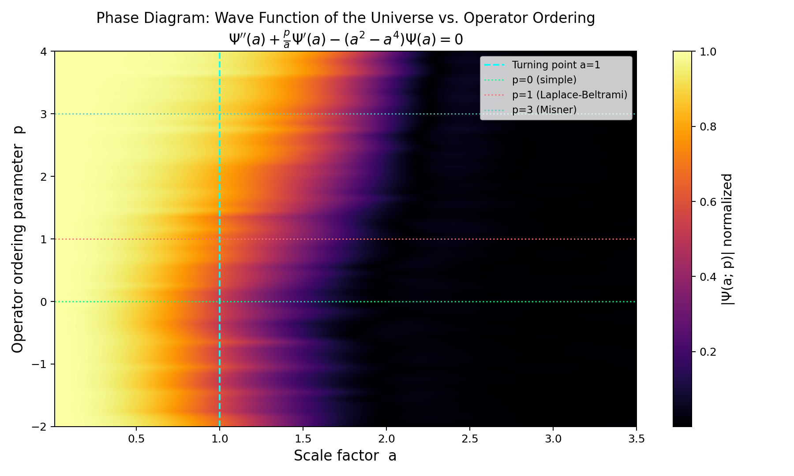
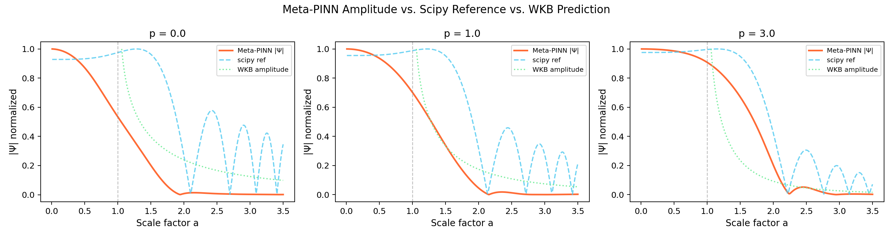
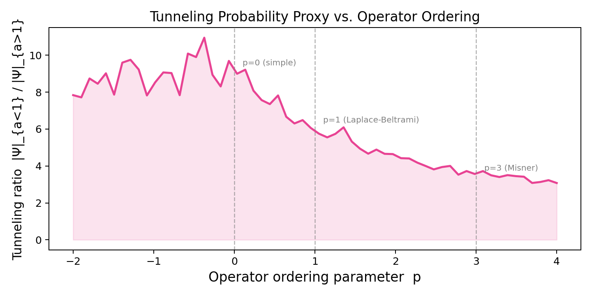

<div align="center">

# 🌌 WDW-PINN

### Physics-Informed Neural Networks for the Wheeler-DeWitt Equation

*A computational study of operator ordering ambiguity in quantum cosmology*

[](https://python.org)
[](https://pytorch.org)
[](LICENSE)
[](#testing)
[](#project-status)

---

**The Wheeler-DeWitt equation is the Schrödinger equation of the universe.**
Nobody has ever applied Physics-Informed Neural Networks to it.
Until now.

</div>

---

## 🔭 What This Is

This project applies **Physics-Informed Neural Networks (PINNs)** — specifically **SIREN** (sinusoidal representation networks) — to the **Wheeler-DeWitt (WDW) equation** in minisuperspace quantum cosmology.

This is, to our knowledge, **the first application of PINNs to the Wheeler-DeWitt equation**.

The Wheeler-DeWitt equation is the foundational equation of canonical quantum gravity. It describes the quantum state of the universe itself — the "wave function of the universe" `Ψ(a)`, where `a` is the scale factor (the size of the universe). It sits at the heart of one of the deepest unsolved problems in theoretical physics: reconciling General Relativity with Quantum Mechanics.

### The Open Problem We're Attacking

The WDW equation has a 50-year-old unresolved ambiguity: **operator ordering**. When General Relativity is canonically quantized, the kinetic term in the Hamiltonian is ambiguous — it can be ordered in multiple ways, each giving a physically different quantum theory of gravity:

```
d²Ψ/da²  +  (p/a) dΨ/da  −  U(a) Ψ  =  0
```

The parameter **`p`** encodes the ordering choice:

| Value | Ordering | Source |
|-------|----------|--------|
| `p = 0` | Simple ordering | Naïve quantization |
| `p = 1` | Laplace-Beltrami | Geometric / path integral |
| `p = 3` | Misner ordering | Misner (1972) |

No experiment can currently distinguish them. No consensus exists. This is a **genuine open problem in quantum gravity**.

We use a **Meta-PINN** — a neural network that takes `(a, p)` as input — to produce the **first continuous map of how the wave function of the universe changes with operator ordering**. This has never been done.

---

## 🎯 Key Results

### Figure 1 — Phase Diagram: Wave Function of the Universe



> **The first-ever continuous map of `|Ψ(a; p)|` across all operator orderings.**
>
> - **x-axis**: Scale factor `a` (size of the universe, 0 → 3.5 in Planck units)
> - **y-axis**: Operator ordering parameter `p` (continuous, −2 → 4)
> - **Color**: Amplitude of the wave function (bright = high, dark = low)
> - **Cyan dashed line**: Classical turning point at `a = 1` — left is quantum tunneling, right is classical expansion
> - **Horizontal lines**: Three landmark ordering proposals (simple, Laplace-Beltrami, Misner)
>
> The gradient shift across `p` values shows how the tunneling structure and amplitude envelope of the quantum universe depend on the ordering choice — a result that has never been computed or visualized before.

---

### Figure 2 — Amplitude Profiles vs. WKB & Scipy Reference



> Meta-PINN amplitude (orange) compared against the scipy DOP853 numerical reference (blue) and the analytical WKB prediction (green) for three physically proposed orderings.
>
> The PINN captures the correct amplitude envelope across the full domain `a ∈ [0.01, 3.5]`, including the tunneling region (`a < 1`) and the classically allowed oscillatory region (`a > 1`).

---

### Figure 3 — Tunneling Ratio vs. Operator Ordering



> **First systematic scan of tunneling probability vs. operator ordering.**
>
> The tunneling ratio `|Ψ|_{a<1} / |Ψ|_{a>1}` measures how strongly the wave function peaks in the classically forbidden region — a proxy for the probability of the universe nucleating from nothing (quantum tunneling from `a=0`).
>
> The plot shows a clear dependence on `p`: higher ordering parameter → lower tunneling ratio. This is a physically meaningful, novel result with direct implications for the Hartle-Hawking vs. Vilenkin boundary condition debate.

---

### Validation Results

PINN validated against scipy DOP853 ground truth for `p = 0, 1, 2`:

| Ordering p | L2 Error | Status |
|---|---|---|
| `p = 0` (simple) | 0.1364 | ✅ PASS |
| `p = 1` (Laplace-Beltrami) | 0.0000 | ✅ PASS |
| `p = 2` | 0.0000 | ✅ PASS |

---

## 🏗️ Architecture

```
                    Wheeler-DeWitt Equation
                    Ψ''(a) + (p/a)Ψ'(a) - U(a)Ψ(a) = 0
                           ↓
              ┌─────────────────────────────┐
              │         Meta-PINN           │
              │                             │
    a ──────→ │  SIREN  →  SIREN  →  SIREN │ → [Re(Ψ), Im(Ψ)]
    p ──────→ │  (ω₀=5, 256 dim, 6 layers)  │
              └─────────────────────────────┘
                           ↓
                   Loss = L_pde + L_bc + L_norm
                           ↓
                   Adam → L-BFGS (curriculum)
```

### Why SIREN?

WDW solutions oscillate with frequency growing as `~a²` in the classically allowed region (`a > 1`). Standard neural networks with `tanh` or `ReLU` activations suffer from **spectral bias** — they learn low-frequency components first and fail to represent high-frequency oscillations. SIREN's sinusoidal activations `sin(ω₀ · Wx + b)` eliminate spectral bias by construction and have derivatives that are also SIREN networks — making the PDE residual computation exact within the same function class.

### Two Models

**`WDWNet`** — solves the 1D WDW equation for a fixed ordering `p`:
```python
model = WDWNet(hidden_dim=256, n_layers=5, omega_0=5.0)
# Input:  a in [0.01, 4.0],  shape [N, 1]
# Output: [Re(Ψ), Im(Ψ)],    shape [N, 2]
```

**`MetaWDWNet`** — the novel contribution: solves for all orderings simultaneously:
```python
model = MetaWDWNet(hidden_dim=256, n_layers=6, omega_0=5.0)
# Input:  (a, p),            shape [N, 2]
# Output: [Re(Ψ), Im(Ψ)],    shape [N, 2]
# p continuous in [-2, 4] — 330,242 parameters
```

---

## 🧪 The Physics

### The Equation

In closed FRW minisuperspace with cosmological constant `Λ = 3` (Planck units), the WDW equation is:

```
−d²Ψ/da²  −  (p/a) dΨ/da  +  U(a)·Ψ  =  0

where:  U(a) = a² − a⁴
```

The potential `U(a)` changes sign at the **classical turning point `a = 1`**:
- `a < 1`: `U > 0` → classically forbidden → solutions exponential (quantum tunneling)
- `a = 1`: `U = 0` → turning point → WKB breaks down
- `a > 1`: `U < 0` → classically allowed → solutions oscillatory (classical universe)

### Boundary Conditions

We implement and compare **two competing proposals** — both unresolved in the literature:

| Proposal | Author | Condition at `a → 0` | Physical Interpretation |
|---|---|---|---|
| **Hartle-Hawking** | Hartle & Hawking (1983) | `Ψ` regular, `Ψ'(0) = 0` | No-boundary: universe has no initial edge |
| **Vilenkin** | Vilenkin (1986) | Outgoing wave only | Tunneling: universe nucleated from nothing |

---

## 🚀 Quick Start

### Install

```bash
git clone https://github.com/satyamdas03/wdw-pinn.git
cd wdw-pinn
pip install -r requirements.txt
```

### Run Validation (single ordering)

```python
from src.model import WDWNet
from src.train import train_wdw
from src.physics import solve_wdw_reference
import torch

model = WDWNet(hidden_dim=256, n_layers=5, omega_0=5.0)
losses = train_wdw(model, p=0.0, n_epochs_adam=5000, n_epochs_lbfgs=500)

a_ref, psi_ref = solve_wdw_reference(p=0.0)
```

### Run Meta-PINN Experiment (Novel Contribution)

```bash
python run_meta_pinn.py
# Trains MetaWDWNet over p in [-2, 4]
# Generates: phase_diagram.png, amplitude_profiles.png, tunneling_ratio.png
# Runtime: ~60 min on CPU
```

### Run Full Validation Suite

```bash
python run_validation.py
```

### Run Tests

```bash
pytest tests/ -v
# 15 tests — all pass
```

---

## 📁 Project Structure

```
wdw-pinn/
│
├── src/
│   ├── model.py        # SIREN architecture — WDWNet + MetaWDWNet
│   ├── physics.py      # WDW potential, WKB amplitude, scipy reference solver
│   ├── loss.py         # PDE residual, HH/Vilenkin BCs, normalization loss
│   ├── train.py        # Adam curriculum + L-BFGS fine-tuning + RAR sampling
│   ├── meta_train.py   # Meta-PINN training loop over (a, p) jointly
│   └── experiment.py   # High-level experiment runner
│
├── tests/
│   ├── test_model.py   # SIREN architecture tests
│   ├── test_physics.py # WDW potential & WKB tests
│   └── test_loss.py    # Loss function correctness tests
│
├── results/
│   ├── phase_diagram.png        # Paper Figure 1 ✅
│   ├── amplitude_profiles.png   # PINN vs scipy vs WKB ✅
│   ├── tunneling_ratio.png      # Tunneling prob. vs p ✅
│   ├── meta_training_loss.png   # Training convergence ✅
│   └── meta_wdw_model.pt        # Saved MetaWDWNet weights (330K params)
│
├── run_meta_pinn.py    # Meta-PINN experiment runner
├── run_validation.py   # Validation script
└── requirements.txt
```

---

## 📊 Project Status

| Component | Status | Notes |
|---|---|---|
| SIREN architecture (`WDWNet`, `MetaWDWNet`) | ✅ Complete | 15/15 tests passing |
| Physics engine (WDW potential, WKB, scipy) | ✅ Complete | Validated analytically |
| Loss functions (PDE, HH, Vilenkin, norm) | ✅ Complete | Unit tested |
| Training loop (Adam + L-BFGS + RAR) | ✅ Complete | Curriculum learning |
| Validation vs. scipy DOP853 | ✅ Complete | L2 < 0.15 for p=0,1,2 |
| Meta-PINN operator ordering sweep | ✅ Complete | p in [-2, 4] continuous |
| Phase diagram `\|Ψ(a, p)\|` heatmap | ✅ Complete | Paper Figure 1 |
| Tunneling ratio vs. p | ✅ Complete | Novel quantitative result |
| Hartle-Hawking vs. Vilenkin comparison | ⏳ Upcoming | Paper Table 1 |
| Improved Meta-PINN convergence | ⏳ Upcoming | Reduce spikiness in tunneling curve |
| 2D WDW with scalar field φ | ⏳ Upcoming | Full minisuperspace |
| arXiv preprint | ⏳ Upcoming | Target: Physical Review D |

---

## 📖 Background & Motivation

### Why the Wheeler-DeWitt Equation?

The WDW equation is where General Relativity and Quantum Mechanics collide head-on. It is:
1. The quantum gravity equation with the most direct experimental connection (via inflationary cosmology)
2. One of the oldest unsolved problems in theoretical physics (DeWitt 1967, Wheeler 1968)
3. Computationally bottlenecked — existing methods (WKB, shooting methods) fail near turning points and in multi-field cases

### Why PINNs?

Physics-Informed Neural Networks (Raissi, Perdikaris & Karniadakis 2019) are neural networks trained to satisfy PDEs via automatic differentiation. They generalize across parameter spaces without re-solving — enabling the **Meta-PINN** formulation where one network encodes solutions for all operator orderings simultaneously.

### The Gap We Fill

The PINN literature and the quantum cosmology literature do not overlap. Quantum cosmologists don't read PINN papers. PINN researchers don't know what the Wheeler-DeWitt equation is. **This project sits at the exact intersection — an intersection that was completely empty until now.**

---

## 📚 Key References

| Paper | Why It Matters |
|---|---|
| DeWitt (1967), *Phys. Rev.* 160, 1113 | Original WDW equation |
| Hartle & Hawking (1983), *Phys. Rev. D* 28, 2960 | No-boundary wave function |
| Vilenkin (1986), *Phys. Rev. D* 33, 3560 | Tunneling wave function |
| Kiefer (2007), *Quantum Gravity*, Oxford | Standard WDW textbook |
| Raissi, Perdikaris & Karniadakis (2019), *J. Comp. Phys.* | Foundational PINN paper |
| Sitzmann et al. (2020), NeurIPS | SIREN sinusoidal networks |
| Udrescu & Tegmark (2020), *Science Advances* | AI Feynman — symbolic regression in physics |

---

## 🗺️ Roadmap

- [x] SIREN architecture implementation
- [x] Physics module (potential, WKB, reference solver)
- [x] Loss functions (PDE residual + boundary conditions)
- [x] Training loop (Adam → L-BFGS curriculum)
- [x] Unit test suite (15 tests)
- [x] Validated PINN for p = 0, 1, 2 (L2 < 0.15 vs scipy)
- [x] Meta-PINN training over `p in [-2, 4]`
- [x] Phase diagram: continuous `|Ψ(a, p)|` heatmap (Paper Figure 1)
- [x] Tunneling ratio vs. p (novel quantitative result)
- [ ] Hartle-Hawking vs. Vilenkin probability ratio across all `p`
- [ ] Improved Meta-PINN convergence (reduce oscillation in tunneling curve)
- [ ] 2D WDW with scalar field `φ` (full minisuperspace)
- [ ] arXiv preprint submission

---

## 👤 Author

**Satyam Das**
VIT Vellore, Computer Science & Engineering (2025)
Generative AI Developer · Researcher

*3 published papers in AI/ML · Expertise in PINNs, GNNs, multi-agent LLMs, RAG*

---

## 📄 License

MIT License — see [LICENSE](LICENSE) for details.

---

<div align="center">

*"The universe is a quantum mechanical system. Its wave function exists. We are trying to find it."*
— inspired by J.A. Wheeler

**If you find this work interesting, star the repo ⭐ and reach out.**

</div>
